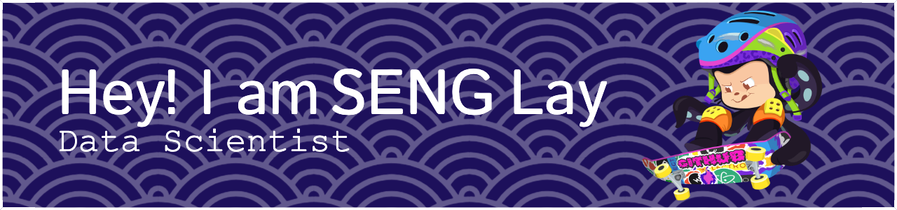

<!-- ### Hi there 👋 -->

<!--
**SengLay/SengLay** is a ✨ _special_ ✨ repository because its `README.md` (this file) appears on your GitHub profile.

Here are some ideas to get you started:

- 🔭 I’m currently working on ...
- 🌱 I’m currently learning ...
- 👯 I’m looking to collaborate on ...
- 🤔 I’m looking for help with ...
- 💬 Ask me about ...
- 📫 How to reach me: ...
- 😄 Pronouns: ...
- ⚡ Fun fact: ...
-->

<!-- <h1 align="center">
  Hi 👋, I'm SENG Lay
</h1> -->

<!-- 

  

 -->

  
  
  

<!--  -->

  

<h3 align="center">
  A highly motivated and results-oriented student with a passion for technology. I'm eager to gain hands-on experience in the field of data science. Moreover, I'm also passionate in ML and AI.
</h3>

- 🔭 I’m currently working on ***Job Analysis - Salary Prediction Project***
- 💬 Ask me about ***Python or other programming languages or about my projects...***
- 📫 How to reach me **senglay.lay333@gmail.com**
- ⚡ Fun fact: ***I don't know any fun facts...***

<!--  -->

<h3 align="left">
  :inbox_tray: Connect with me:
</h3>

  

  

  

<h3 align="left">:hammer_and_wrench: Languages and Tools:</h3>

 
   
   
   
   
   
   
   
   
   
   
   
   

]
